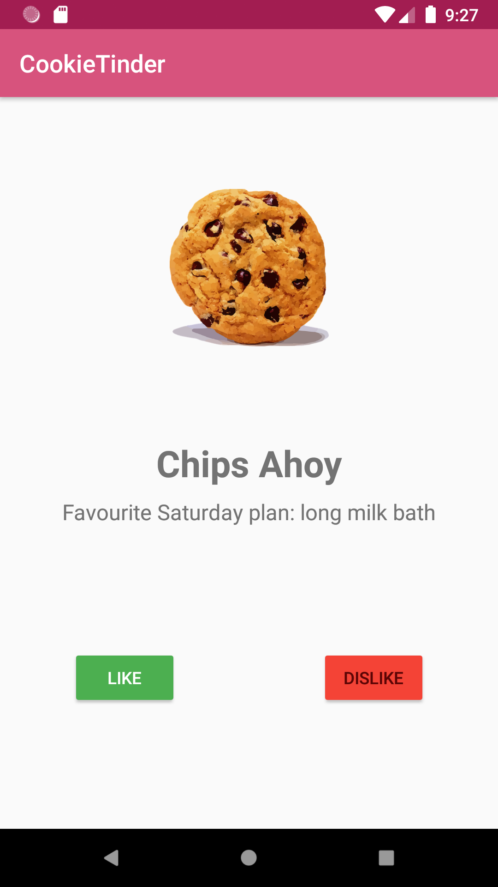

# Workshop: my first Android app with Kotlin

- We are going to learn the basics of Android development
- We are going to use Kotlin
- We are going to practise unit testing in Android with Kotlin

---

## Getting started

We're going to build a dating app for cookies. 



Before starting make sure you have:

* Android Studio installed: https://developer.android.com/studio
* An Android simulator created: https://developer.android.com/studio/run/managing-avds.html
* Alternatively you can use your own device: https://developer.android.com/studio/run/device.html
* This repository cloned
* The branch `01-start` checked out


---
## Organisation
This workshop is organised in branches: 

```
01-start
02-cookie-repository
03-advanced-cookie-repository
04-ui-with-dynamic-data
05-advanced-ui-with-dynamic-data
```

Starting with `00-start` you'll be given a set of tasks to build up an app. Each branch is built on top of the previous one and contains a solution for the given tasks. So if you get stuck, just checkout the next branch and continue!

## 01-start

This branch contains the basic structure for an Android app:

* `MainActivity`: shows a layout with only dummy data.
* `activity_main.xml`: a basic layout has already been created for you.
* The rest of the project contents are the default files generated by Android Studio new project wizard.


### Your tasks

* Go the `MainActivity` and change the app's layout **programatically** to show a hardcoded text for both cookie name and cookie description `TextView`s and a hardcoded image for the cookie `ImageView`

> You can set images in a `ImageView` as `Drawables` or setting the resource directly. For more information, see: https://developer.android.com/reference/android/widget/ImageView

* Bind an action to both buttons by setting up their click listeners

> A visual way to debug user clicks is using [Toast messages](https://developer.android.com/guide/topics/ui/notifiers/toasts)


## 02-cookie-repository
You have now a UI that can be set programatically, but we don't have any data for it! 

We need a repository class to get the data from. In this step you're going to build `CookieRepository` using TDD.


### Your tasks
* There are a set of tests in `CookieRepositoryTest` that don't pass (they don't even compile at the moment!)
* Add content to `CookieRepository` so all the test pass,
* Add any other class you think is necessary,


> In Kotlin, classes that are used only to hold data are called a [*data class*](https://kotlinlang.org/docs/reference/data-classes.html) and they have some cool features ;)

## 03-advanced-cookie-repository

We have new requirements from our Project Manager: 

-  The app must only show Cookies with pictures. We may receive Cookies without picture in our repository but the app must filter them out. 
- The list presented to the user needs to be sorted by Cookie name.
- All Cookie names must be displayed in Camel Case format.


### Your tasks
* There's a new test to model the new requirements and it's not passing.
* Make the necessary changes in `fun getAllCookies(): List<Cookie>` so the new test pass

> The Kotlin Standard Library contains a huge list of [tools for Collections](https://kotlinlang.org/docs/reference/collections-overview.html).

## 04-ui-with-dynamic-data
We have a working repository class, it's time to use it!
Go back to `MainActivity` and use the data from the repository to populate the UI.

For this workshop, we're passing a hardcoded list of Cookies to the repository to simulate API fetched data. This has already been prepared for you.

### Your tasks
* There's a `CookieRepository` instance created for you in `MainActivity` with some data.
* Make changes in `MainActivity` so the displayed data is read from the repository.
* Change like and dislike click listeners to:
  * Update like or dislike collections in the repository
  * Display the next available Cookie

## 05-advanced-ui-with-dynamic-data 
Final step! We have a working interface that reads data from a repository. Let's try to make it better. Here are some ideas:

### Your tasks
* When the user reaches the end of the list show an empty state with a message (instead of a crash!) You can use the placeholder image from the beginning.
* Add a new button to skip a Cookie without liking or disliking it. When the user reaches the end of the list, it must go back and present again only the skipped ones.
* Add a new Activity to list all your liked Cookies.

> In Android, list of UI elements are created using something called a [RecyclerView](See https://developer.android.com/guide/topics/ui/layout/recyclerview)

